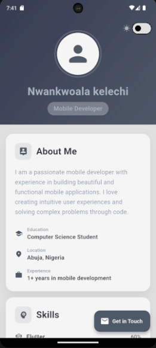
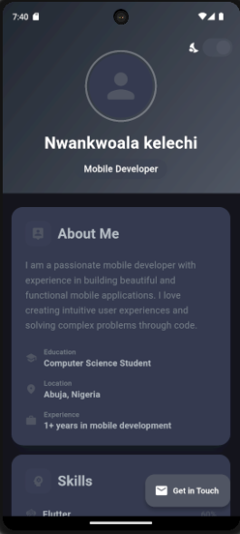

# 📱 Personal Portfolio App

A beautiful, modern portfolio mobile application built with Flutter featuring smooth animations, theme switching, and a clean UI. Created as part of HNG Mobile Internship Stage 0.


## ✨ Features

- 🎨 **Light & Dark Theme** - Seamless theme switching with custom color schemes
- 🎭 **Smooth Animations** - Fade-in and slide-up effects on all sections
- 👤 **About Section** - Personal information with icon-based info cards
- 💪 **Skills Section** - Animated progress bars showing skill proficiency levels
- 🚀 **Projects Section** - Showcase of projects with detailed descriptions
- 📞 **Contact Section** - Clickable contact items with deep linking (email, phone, social media)
- 📱 **Responsive Design** - Works seamlessly across different screen sizes
- 🎯 **Clean Architecture** - Modular, organized, and maintainable codebase

## 🛠️ Tech Stack

- **Framework:** Flutter 3.9.2+
- **Language:** Dart
- **State Management:** Provider (6.1.5+1)
- **Packages:** 
  - url_launcher (6.2.0) - For deep linking
  - cupertino_icons (1.0.8) - iOS style icons
- **Architecture:** Component-based with separated concerns

## 📂 Project Structure

```
lib/
├── main.dart                      # App entry point & theme setup
├── pages/
│   └── home_page.dart            # Main home page with SliverAppBar
├── components/
│   ├── animated_section.dart     # Reusable animation wrapper
│   ├── about_section.dart        # About me section
│   ├── skills_section.dart       # Skills with animated progress bars
│   ├── projects_section.dart     # Projects showcase cards
│   └── contact_section.dart      # Contact information with links
├── models/
│   ├── skill_model.dart          # Skill data model
│   └── project_model.dart        # Project data model
├── services/
│   ├── theme/
│   │   ├── light_mode.dart       # Light theme configuration
│   │   ├── dark_mode.dart        # Dark theme configuration
│   │   └── theme_provider.dart   # Theme state management
│   └── url/
│       └── url_launcher_service.dart  # URL launching utilities
└── utils/
    └── constants.dart            # App constants and portfolio data
```

## 🚀 Getting Started

### Prerequisites

- Flutter SDK (3.9.2 or higher)
- Dart SDK (3.0.0 or higher)
- Android Studio / VS Code with Flutter extensions
- An Android emulator or physical device

### Installation

1. **Clone the repository**

```bash
git clone https://github.com/nuel232/personal-portfolio-app.git
cd personal-portfolio-app
```

2. **Install dependencies**

```bash
flutter pub get
```

3. **Run the app**

```bash
flutter run
```

### Build APK

To generate a release APK for Android:

```bash
flutter build apk --release
```

The APK will be located at: `build/app/outputs/flutter-apk/app-release.apk`

For split APKs (smaller file sizes):

```bash
flutter build apk --split-per-abi
```

## 📸 Screenshots

<!-- Add your screenshots here -->
| Light Mode | Dark Mode |
|------------|-----------|
|  |  |

## 🎯 Key Features Breakdown

### 1. Theme System

- Custom light and dark color schemes
- Persistent theme toggle using Provider
- Smooth transitions between themes

### 2. Animations

- Staggered fade-in animations on page load
- Slide-up effects for section transitions
- Animated progress bars for skills
- Hero animation for profile avatar

### 3. Contact Integration

- **Email**: Direct mailto: links
- **Phone**: Tap to call functionality
- **LinkedIn**: Opens profile in browser
- **GitHub**: Opens repository in browser
- **Twitter/X**: Opens profile in browser

### 4. Sections

- **About**: Personal info with education, location, and experience
- **Skills**: 5 core skills with visual progress indicators
- **Projects**: 3 featured projects with tech stacks
- **Contact**: Multiple ways to get in touch

## 💻 Code Highlights

### Modular Components

Each section is a separate, reusable component making the codebase clean and maintainable.

### State Management

Uses Provider for efficient theme state management across the app.

### Smooth Animations

Custom animation controller with fade and slide transitions:

```dart
AnimationController(
  duration: const Duration(milliseconds: 800),
  vsync: this,
)
```

### Deep Linking

URL launcher integration for seamless external app launching.

## 📚 Key Learning Outcomes

Through this project, I learned:

- ✅ Implementing smooth, professional animations in Flutter
- ✅ State management patterns with Provider
- ✅ Building reusable component architecture
- ✅ Theme switching and customization techniques
- ✅ Deep linking with url_launcher package
- ✅ Clean code organization and separation of concerns
- ✅ Building for production (APK generation)
- ✅ Responsive design principles

## 🔗 Live Demo

🌐 **Try the app**: [Appetize.io Demo](https://appetize.io/app/b_se5my2llr3fa4lgljb4ikqwdjm)

## 👨‍💻 Author

**Nwankwoala Kelechi**

- 📧 Email: [nwankwoala3@gmail.com](mailto:nwankwoala3@gmail.com)
- 💼 LinkedIn: [linkedin.com/in/nwankwoala-kelechi](https://linkedin.com/in/nwankwoala-kelechi)
- 🐦 Twitter: [@kelechixx_](https://twitter.com/kelechixx_)
- 💻 GitHub: [@nuel232](https://github.com/nuel232)
- 📱 Phone: +234 915 641 4321

## 🤝 Contributing

Contributions, issues, and feature requests are welcome! Feel free to check the [issues page](https://github.com/nuel232/personal-portfolio-app/issues).

## 📝 Customization

To personalize this portfolio for yourself:

1. Update `lib/utils/constants.dart` with your information
2. Replace project details in the same constants file
3. Update skill levels to match your proficiency
4. Add your own screenshots to `/screenshots` folder


## 🙏 Acknowledgments

- Built as part of **HNG Mobile Internship Stage 0**
- Thanks to the HNG community for this incredible learning opportunity
- Inspired by modern mobile app design principles

## 🌟 Show Your Support

If you found this project helpful or learned something from it, please consider:

- ⭐ Starring this repository
- 🔄 Sharing it with others
- 💬 Providing feedback

## 📈 Future Enhancements

Potential improvements for future versions:

- [ ] Add profile image upload functionality
- [ ] Integrate with a backend for dynamic content
- [ ] Add more project details with screenshots
- [ ] Implement resume/CV download feature
- [ ] Add GitHub contribution graph
- [ ] Include testimonials section
- [ ] Deploy to Google Play Store

---


## 🔖 Tags

`flutter` `dart` `mobile-development` `portfolio-app` `hng-internship` `provider` `animations` `material-design` `cross-platform` `android` `ios`